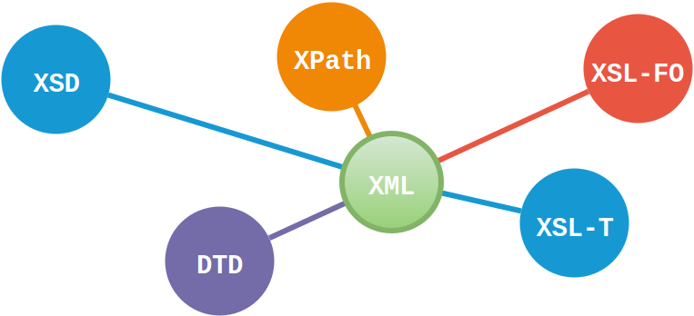

# XML Eindopdracht
This repository contains the final assignment of the module XML given at NHLStenden univercity of applied sciences. During this module we got an introduction in writing XML documents, DTD, XSD scheme and transforming XML with XSL and XSL-FO.

[TOC]: # "Table of contents"

## Table of contents
- [XML Eindopdracht](#xml-eindopdracht)
    - [Products](#products)
    - [Authors](#authors)
    - [Licencing](#licencing)

## Products
 - **Omschrijving DTD**
   - [omschrijving dtd (docx))](Omschrijving_DTD.docx)
   - [Omschrijving DTD (pdf)](Omschrijving_DTD.pdf)
 - **XML Schema's**
   - [Eindopdracht (dtd)](Eindopdracht.dtd)
   - [Eindopdracht (xsd)](Eindopdracht.xsd)
- **XML Data**
   - [Eindopdracht (xml)](Eindopdracht.xml)
- **XML Transform met XSL-T**
   - [Eindopdracht (xsl))](Eindopdracht.xsl)
   - [Eindopdracht Transform (html ouput))](Eindopdracht.html)
   - [Eindopdracht Transform (html ouput in mardown))](Eindopdracht.md)

## Authors
 - [David Dorenbos](https://github.com/DavidDorenbos)
 - [Ivar Huizing](https://github.com//IvarHuizing)
 - [Michiel Tombergen](https://github.com/MichielTombergen)
 - [Andrej Rodzevic](https://github.com/andrew946)
 - [Thomas Fluit]()
 - [Joris Rietveld\(https://github.com/jorisrietveld)

## Licencing
XML Eindopdracht - The final assignment for the module XML.
Copyright (C) 2018 Members of the INF2G project group & Joris Rietveld

This program is free software: you can redistribute it and/or modify
it under the terms of the GNU General Public License as published by
the Free Software Foundation, either version 3 of the License, or
(at your option) any later version.

This program is distributed in the hope that it will be useful,
but WITHOUT ANY WARRANTY; without even the implied warranty of
MERCHANTABILITY or FITNESS FOR A PARTICULAR PURPOSE.  See the
GNU General Public License for more details.

You should have received a copy of the GNU General Public License
along with this program.  If not, see <http://www.gnu.org/licenses/>.

This page is licensed under a <a rel="license" href="http://creativecommons.org/licenses/by-sa/4.0/">Creative Commons Attribution-ShareAlike 4.0 International License</a>.

